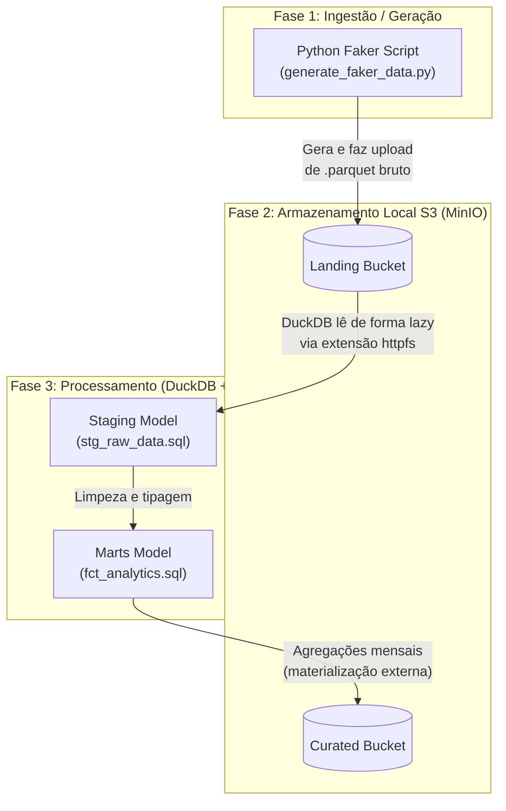

# Antigravity ETL Framework 🚀

Este projeto é um framework moderno de ETL que utiliza **DuckDB** como motor de processamento analítico, **dbt-core** para orquestração das transformações e **MinIO** rodando via Podman para simular o armazenamento S3 da AWS localmente.

## 🏗 Arquitetura e Fluxo de Dados

O fluxo de dados do projeto segue o padrão Medallion (adaptado para Landing e Curated):



### Explicação do Fluxo:
1. **Ingestão**: O script Faker gera a massa de dados transacionais fictícia e a salva no bucket `landing` do MinIO em Parquet.
2. **Staging**: O dbt utiliza o adaptador do DuckDB para ler os arquivos `.parquet` diretamente ('httpfs' lazy load) pela rede para a *view* local (`stg_raw_data`).
3. **Marts & Curated**: Os modelos analíticos consolidados executam processamento pesado e escrevem o resultado no MinIO (`curated`), através da configuração `materialized='external'`.

## 🛠 Pré-requisitos
- **Podman Desktop** ou CLI do Podman (com `podman-compose`) instalado localmente.

## 🚀 Como Executar Localmente - 100% Conteinerizado

A solução agora empacota todas as dependências de ambiente (Data e dbt) dentro de um Podman customizado para que nenhum requisito Python (ex. dbt, boto3, pyarrow) suje a máquina local do desenvolvedor.

Disponibilizamos um script (`run_pipeline.sh`) que roda o fluxo de ponta-a-ponta e limpa a infraestrutura ao executar o *end*.

```bash
# Dar permissão de execução
chmod +x run_pipeline.sh

# Rodar pipeline
./run_pipeline.sh
```

** O que o script E2E fará dinamicamente:**
1. **Infraestrutura**: Irá inicializar o MinIO via `podman-compose` e configurar a arquitetura de buckets.
2. **Build de Dependências**: Fara o build do `Dockerfile` (`antigravity-etl`) isolando o Python e dbt no container.
3. **Execution Pipeline**: Irá acionar as injeções do Faker e disparar o Processamento dbt (`run` e `test`) dentro do container.
4. **End/Teardown**: Finalizando todos as etapas ele vai executar um `podman-compose down`, limpando do seu ambiente local os componentes e volume de rede em background para encerrar o processo com segurança.

## 🔄 Pipeline CI/CD Integrado (GitHub Actions)
O arquivo de integração (`ci.yml`) também reproduz com máxima fidelidade esse mesmo setup via conteiners em 3 fases: Infraestrutura -> Build do app conteinerizado -> Disparo do fluxo ETL -> Teardown (Sempre garantido o Teardown no end de todas actions).
